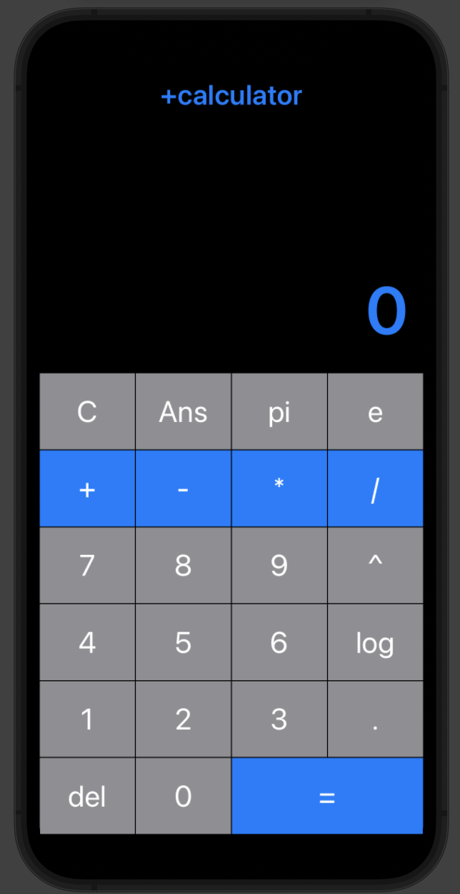
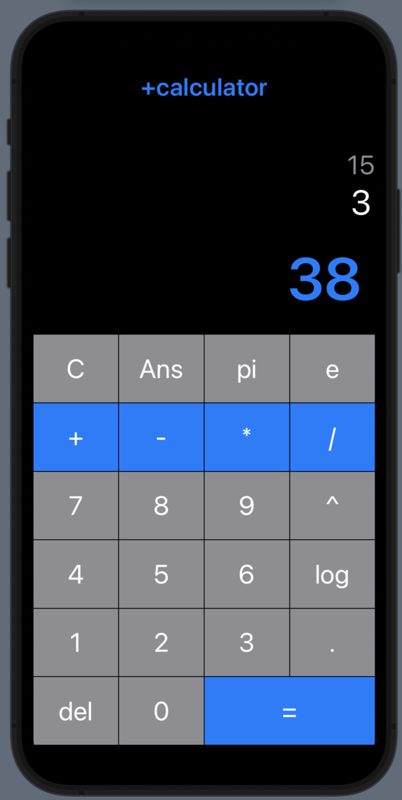

# PlusCalculator

A calculator mobile app made on SwiftUI

As of this README, the calculator works with integers (so Pi, e and the decimal button are not implemented) and has some bugs that have to be worked on.

  
   

